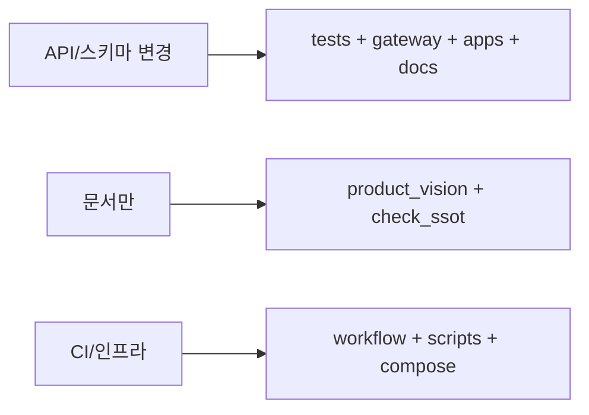

# 모노레포 변경 — 영향 범위

## 관련 스킬

- SSOT·중복: [prevent-duplicate-code-conflicts](../prevent-duplicate-code-conflicts/SKILL.md)  
- 비전 문서 동기화: [docs-plan-sync-1-1](../docs-plan-sync-1-1/SKILL.md)

## 경로 맵 (이 템플릿)

| 경로 | 바꾸면 같이 볼 곳 |
|------|-------------------|
| `services/gateway/app/` | `services/gateway/tests/`, `docs/product`, `apps/*`의 게이트웨이 호출 |
| `services/gateway/scripts/` | [`.github/workflows/ci.yml`](../../../.github/workflows/ci.yml) (`check_ssot_docs.py` 등) |
| `docs/product/*.md` | [`app/product_vision.py`](../../../services/gateway/app/product_vision.py), [`scripts/check_ssot_docs.py`](../../../services/gateway/scripts/check_ssot_docs.py) |
| `.github/workflows/` | 게이트웨이 디렉터리, `python-version`, 스크립트 경로 |
| `infra/` | 게이트웨이 `.env`, [mobile-genai-local-dev](../mobile-genai-local-dev/SKILL.md), [infra-terraform-touch](../infra-terraform-touch/SKILL.md) |
| `apps/ios/Sources/` | SwiftUI/MVVM 뷰·ViewModel 추가 시 동일 기능 Android 여부 |
| `apps/android/app/src/main/java/template/` | Kotlin 패키지 `template.feature.*` — iOS 대응 화면 |

## 변경 유형별 분기

## 짧은 절차

1. 변경 파일 목록을 고정한다.  
2. **심볼·문자열·URL**로 `rg`/검색: `apps/`, `services/`, `docs/`, `.github/` 순.  
3. 테스트·CI·문서 중 **한 곳도 안 건드리면 이상**한 경우가 없는지 확인한다.

## 에이전트 지침

- PR 설명에 **영향 받는 패키지/앱**을 한 줄로 적는다 (예: gateway only / docs+gateway).  
- 공유 상수 이동 시 **SSOT 스킬**([prevent-duplicate-code-conflicts](../prevent-duplicate-code-conflicts/SKILL.md))과 함께 적용한다.

## 추가 참고

- 레이어 감사 템플릿: [prevent-duplicate-code-conflicts/reference.md](../prevent-duplicate-code-conflicts/reference.md)
