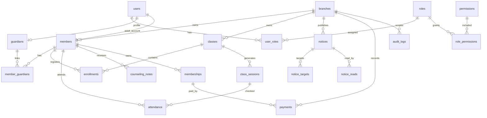

# 파이널 유도 멀티짐 MVP 백엔드 및 DB 스키마 설계

## 1. 설계 목표

이 문서는 파이널 유도 멀티짐 MVP의 백엔드 경계와 PostgreSQL 기준 DB 스키마를 정의한다. MVP의 우선순위는 회원/보호자 관계, 지점 단위 데이터 격리, 역할 기반 접근 제어, 출석/결제 운영, 감사 로그의 안정성이다.

핵심 원칙은 다음과 같다.

- `users`는 로그인 가능한 계정이고, `members`는 실제 수련자 프로필이다.
- 미성년 회원 접근은 `guardian -> member` 관계로만 허용한다.
- 대표와 코치는 `branch_id`가 있는 역할 배정으로만 지점 데이터에 접근한다.
- 모든 운영 핵심 테이블은 `branch_id`를 가진다.
- 권한 검사는 RBAC, 지점 스코프, 리소스 관계 검사를 함께 통과해야 한다.
- 주요 쓰기 작업과 민감 조회/내보내기는 `audit_logs`에 남긴다.

## 2. 권장 백엔드 구조

권장 스택은 TypeScript 기반 API 서버와 PostgreSQL이다. 프레임워크는 NestJS 또는 Fastify를 권장한다. ORM을 쓴다면 Prisma를 사용할 수 있지만, 권한/감사/부분 인덱스/RLS는 SQL 마이그레이션으로 명시 관리한다.

모듈 경계는 다음과 같이 둔다.

| 모듈 | 책임 |
| --- | --- |
| Auth | 로그인, 비밀번호 재설정, 토큰 발급, 세션 무효화 |
| RBAC | 역할, 권한, 사용자 역할 배정, 권한 캐시 |
| Branches | 지점 생성/수정, 대표 배정, 지점 설정 |
| Users | 계정 생성, 초대, 비활성화, 프로필 |
| Families | 회원, 보호자, 보호자-자녀 연결 |
| Classes | 수업, 수업 회차, 정원, 코치 배정 |
| Enrollments | 회원의 수업 등록/휴회/종료 |
| Attendance | 출석 체크, 출석 수정, 출석 메모 기록 |
| Notices | 공지 작성, 대상 지정, 읽음 처리 |
| Counseling | 상담/주의사항/수업 메모 |
| Memberships | 회원권/수강권 상태 |
| Payments | 수기 결제, 미납, 환불, 할인 |
| Audit | 감사 로그 기록, 조회, CSV 내보내기 기록 |
| Pilot Readiness | 파일럿 준비 항목 상태, 담당자, 증빙 추적 |
| Pilot Incidents | 파일럿 운영 중 장애/이슈, 우회책, 운영 중단 판단 기록 |
| Pilot Operations | 파일럿 2주 운영 일자별 출석/결제/공지 후속/공지 확인 수치와 증빙 추적 |

API는 `/api/v1` 아래 REST를 기본으로 한다. 지점 스코프 리소스는 가능한 한 `/branches/:branchId/...` 경로를 사용한다. 회원/보호자 본인 화면은 `/me/...` 경로를 따로 제공하여 내부적으로 관계 기반 권한 검사를 수행한다.

## 3. 도메인 관계 요약



## 4. RBAC 설계

### 4.1 역할

MVP 기본 역할은 다음과 같다.

| 역할 코드 | 범위 | 설명 |
| --- | --- | --- |
| `super_admin` | global | 전체 지점, 권한, 감사 로그를 관리한다. |
| `branch_owner` | branch | 배정된 지점의 회원, 직원, 수업, 결제를 관리한다. |
| `coach` | branch | 담당 지점/수업의 출석과 제한 회원 정보를 본다. |
| `guardian` | self + relation | 연결된 자녀의 정보에 접근한다. |
| `member` | self | 본인 일정, 출석, 회원권, 공지를 본다. |

대표가 복수 지점을 운영하면 `user_roles`에 지점별 `branch_owner` 역할을 여러 행으로 부여한다. 총괄 어드민은 `branch_id = NULL`인 `super_admin` 역할을 가진다.

### 4.2 권한 코드 예시

권한은 `resource.action` 형태의 문자열로 관리한다.

| 권한 | 설명 |
| --- | --- |
| `branches.create` | 지점 생성 |
| `branches.read` | 지점 조회 |
| `branches.update` | 지점 수정 |
| `users.manage` | 사용자 생성/비활성화 |
| `rbac.manage` | 역할 배정/회수 |
| `members.read.full` | 회원 전체 개인정보 조회 |
| `members.read.limited` | 출석 운영에 필요한 회원 제한 정보 조회 |
| `members.write` | 회원 생성/수정 |
| `guardians.write` | 보호자 생성/연결 수정 |
| `classes.read` | 수업/시간표 조회 |
| `classes.write` | 수업/시간표 관리 |
| `attendance.write` | 출석 체크/수정 |
| `notices.publish` | 공지 작성/발행 |
| `counseling_notes.read` | 상담/주의 메모 조회 |
| `counseling_notes.write` | 상담/주의 메모 작성 |
| `memberships.write` | 회원권 등록/수정 |
| `payments.read` | 결제 상세 조회 |
| `payments.write` | 수기 결제 기록 |
| `payments.refund` | 환불 처리 |
| `audit_logs.read` | 감사 로그 조회 |
| `exports.create` | CSV 내보내기 |

### 4.3 권한 판정 순서

모든 API는 다음 순서로 접근을 판단한다.

1. 인증된 `actor_user_id`를 확인한다.
2. 사용자의 활성 `user_roles`와 `role_permissions`를 조회한다.
3. 요청 리소스의 `branch_id`를 서버에서 계산한다. 클라이언트가 보낸 `branch_id`를 신뢰하지 않는다.
4. `super_admin`이면 전역 권한을 허용하되 민감 조회와 쓰기는 감사 로그를 남긴다.
5. 지점 역할이면 `user_roles.branch_id = resource.branch_id`를 만족해야 한다.
6. `guardian`이면 `member_guardians`의 활성 연결을 만족해야 한다.
7. `member`이면 `members.user_id = actor_user_id`인 본인 리소스만 허용한다.
8. 코치 권한은 지점 권한에 더해 담당 수업 여부를 추가로 검사한다.

권한 판정은 애플리케이션 서비스에서 1차 수행하고, PostgreSQL Row Level Security를 2차 방어선으로 둘 수 있다.

### 4.4 MVP 런타임 저장소 전환 단계

현재 Next.js MVP route handler는 정규화 서비스 레이어로 완전히 분해하기 전까지 하나의 운영 스냅샷을 읽고 쓰는 구조다. 파일럿 운영에서 파일 저장소 대신 PostgreSQL을 사용할 수 있도록 `app_runtime_state` JSONB 테이블을 둔다.

- 기본 개발 모드: `.data/final-judo-db.json` (`PILOT_DB_FILE` 우선, 없으면 `FINAL_JUDO_DATA_DIR`/`final-judo-db.json`)
- 파일럿 DB 모드: `FINAL_JUDO_DB_DRIVER=postgres`, `FINAL_JUDO_POSTGRES_URL=...`
- 테이블: `app_runtime_state`
- 키: `FINAL_JUDO_POSTGRES_STATE_KEY` 기본값 `mvp`
- 검증: `npm run test:postgres-store`
- 동시 쓰기: 읽은 스냅샷의 비직렬화 revision/base 메타를 다음 쓰기까지 전파한다. revision이 바뀌었으면 컬렉션 `id`와 필드 단위 3-way merge로 서로 다른 추가·수정·삭제를 최신 스냅샷에 적용하고, 같은 필드가 서로 다르게 변경된 경우 `RuntimeStateMergeConflictError`로 중단해 조용한 lost update를 막는다. 결제 레코드는 금액·환불·온라인 요청의 순서가 중요하므로 같은 `payment.id`의 동시 변경을 필드 단위로 자동 병합하지 않는다.
- 병합 후 무결성: 사용자 휴대폰은 국가번호/구분 문자를 제거한 값, 이메일은 소문자 기준으로 유일해야 한다. 사용자 지점·회원 연결, 회원 담당 코치·학부모, 수업 코치·회원, 출석 회차·회원, 결제 회원·지점, 공지 대상, 푸시 구독 사용자 참조를 다시 확인하고 위반 시 `RuntimeStateIntegrityError`로 전체 쓰기를 중단한다.
- JSON 다중 프로세스: `.locks` 파일시스템 디렉터리 잠금으로 operation/read/write를 직렬화하고 조회·쓰기 직전에 primary를 다시 읽는다. 읽기 전용 인스턴스도 디스크 내용이 달라지면 캐시와 로컬 revision을 갱신한다. 로컬 revision이 같아도 base와 디스크 최신본이 다르면 3-way merge하며, 2분 이상 남은 비정상 lock만 복구한다. primary 교체가 끝난 뒤 백업 pruning 실패는 커밋된 쓰기를 실패로 되돌리지 않는다.
- 결제 재시도: 같은 요청 키는 transaction-scoped PostgreSQL advisory lock으로 여러 앱 인스턴스 사이에서 직렬화한다. 잠금 내부 read/write는 같은 트랜잭션 연결을 사용한다.
- 스냅샷 포함 collection: `pilotReadinessChecks`, `pilotIncidents`
- 파일럿 운영 증빙 collection: `pilotOperationLogs`. 출석 기록이 있는 `verified` 로그는 `mobileAttendanceDurationSeconds <= 30`과 `mobileAttendanceEvidence`를 함께 저장한다.
- 운영 계정 로그인: runtime snapshot의 `users.passwordHash`는 서버 전용 PBKDF2 해시로 보강하며 bootstrap/snapshot 응답에서는 제거한다. 총괄 어드민의 임시 비밀번호 발급은 원문을 저장하지 않고 랜덤 salt 해시, 발급 시각, `auth.password_reset.complete` 감사 로그만 남긴다.
- 기본 파일럿 준비 체크는 기존 runtime row에 누락된 항목이 있어도 서버 검증 단계에서 병합한다. 계정별 비밀번호 교체 확인은 `security` 카테고리로 관리한다.

정규화 테이블은 장기 운영 기준이고, `app_runtime_state`는 route handler/API 계약을 유지하면서 운영 DB에 붙이기 위한 전환 단계다. 3-way merge는 전환 단계의 데이터 유실 방어이며 동일 레코드의 복잡한 비즈니스 트랜잭션을 대체하지 않으므로 장기 운영에서는 아래 정규화 테이블과 행 단위 트랜잭션으로 이전한다.

## 5. 지점 스코프 정책

`members`, `classes`, `class_sessions`, `enrollments`, `attendance`, `notices`, `counseling_notes`, `memberships`, `payments`, `audit_logs`는 `branch_id`를 가진다.

지점 격리 규칙은 다음과 같다.

- 지점 운영 화면의 모든 목록 조회는 `WHERE branch_id = :branchId`를 기본 조건으로 가진다.
- `branch_id`는 URL이나 입력값보다 참조 리소스에서 파생한 값을 우선한다.
- 다른 테이블을 통해 접근하는 경우에도 최종 리소스의 지점과 사용자의 역할 지점이 같아야 한다.
- 보호자는 지점 역할이 없어도 자녀 연결이 있으면 해당 자녀 관련 리소스만 볼 수 있다.
- 복수 지점 이용은 MVP에서 예외 케이스로 보고, 회원의 기본 소속 지점은 하나만 둔다.

## 6. 보호자-자녀 관계

보호자는 `users` 계정과 `guardians` 프로필을 가진다. 수련자는 `members`에 저장한다. 성인 회원은 `members.user_id`를 통해 본인 계정과 연결할 수 있고, 미성년 회원은 최소 1개의 활성 `member_guardians` 연결을 가져야 한다.

`member_guardians`는 다음 정책을 책임진다.

- 한 보호자는 여러 자녀와 연결될 수 있다.
- 한 회원은 여러 보호자를 가질 수 있다.
- 회원별 대표 보호자는 1명만 허용한다.
- 결제 안내 수신, 픽업 가능 여부, 법정대리 동의 시점을 관계별로 저장한다.
- 보호자에게 보이는 결제 정보는 `can_receive_billing = true`일 때만 상세 상태를 허용한다.

## 7. 감사 로그 정책

감사 로그는 애플리케이션 서비스가 같은 트랜잭션 안에서 기록한다. DB 트리거는 보조 안전망으로 사용할 수 있지만, "누가/왜/어떤 요청에서" 바꿨는지는 애플리케이션 문맥이 필요하므로 서비스 레벨 기록을 기본으로 한다.

반드시 기록할 이벤트는 다음과 같다.

- 로그인 실패 반복, 비밀번호 재설정, 계정 비활성화
- 역할 부여/회수, 권한 변경
- 지점 생성/수정/비활성화
- 회원/보호자 생성/수정/삭제, 보호자-자녀 연결 변경
- 출석 생성/수정, 과거 출석 수정
- 상담/주의 메모 생성/수정/삭제
- 회원권 생성/수정/취소
- 결제 생성/수정, 할인, 환불, 미납 상태 변경
- 개인정보/결제/감사 로그 대량 조회 또는 CSV 내보내기
- 파일럿 준비 상태/담당자/증빙 변경
- 파일럿 운영 이슈 생성/상태 변경과 우회책 기록
- 파일럿 일일 운영 로그 생성/갱신과 14일 운영 증빙 기록

`audit_logs`는 append-only로 운영한다. 일반 애플리케이션 계정에는 update/delete 권한을 주지 않는다. 민감 데이터 원문 전체를 무제한 저장하지 않고, `before_data`와 `after_data`의 휴대폰·이메일·계정 식별값은 마스킹하며 비밀번호·토큰·알림 endpoint는 제거한다. 건강 주의사항·공지 본문·운영 증빙은 원문 대신 변경 여부 또는 건수만 저장한다. 출석 사유처럼 감사 근거가 되는 메모는 유지하되 포함된 연락처와 자격 증명 패턴을 마스킹한다.

## 8. PostgreSQL 스키마 초안

```sql
CREATE EXTENSION IF NOT EXISTS pgcrypto;
CREATE EXTENSION IF NOT EXISTS citext;

CREATE TYPE user_status AS ENUM ('invited', 'active', 'suspended', 'deleted');
CREATE TYPE role_scope AS ENUM ('global', 'branch', 'self');
CREATE TYPE branch_status AS ENUM ('active', 'inactive');
CREATE TYPE member_status AS ENUM ('trial', 'active', 'paused', 'withdrawn');
CREATE TYPE guardian_status AS ENUM ('active', 'inactive');
CREATE TYPE guardian_relationship AS ENUM ('father', 'mother', 'legal_guardian', 'other');
CREATE TYPE class_status AS ENUM ('active', 'paused', 'archived');
CREATE TYPE class_session_status AS ENUM ('scheduled', 'cancelled', 'completed');
CREATE TYPE enrollment_status AS ENUM ('active', 'paused', 'ended', 'waitlisted', 'cancelled');
CREATE TYPE enrollment_type AS ENUM ('regular', 'trial');
CREATE TYPE attendance_status AS ENUM ('present', 'absent', 'late', 'excused');
CREATE TYPE notice_status AS ENUM ('draft', 'published', 'archived');
CREATE TYPE notice_target_type AS ENUM ('branch', 'class', 'member', 'guardian', 'role');
CREATE TYPE note_visibility AS ENUM ('staff_only', 'coach_visible', 'guardian_visible');
CREATE TYPE membership_status AS ENUM ('pending', 'active', 'paused', 'expired', 'cancelled');
CREATE TYPE membership_type AS ENUM ('monthly', 'session_pack', 'trial', 'custom');
CREATE TYPE payment_status AS ENUM ('scheduled', 'paid', 'overdue', 'expiringSoon', 'cancelled', 'refunded', 'partially_refunded');
CREATE TYPE payment_method AS ENUM ('cash', 'bank_transfer', 'card_manual', 'other');
CREATE TYPE pilot_incident_severity AS ENUM ('p0', 'p1', 'p2');
CREATE TYPE pilot_incident_status AS ENUM ('open', 'monitoring', 'resolved');
CREATE TYPE pilot_operation_status AS ENUM ('pending', 'verified', 'blocked');
CREATE TYPE audit_action AS ENUM (
  'create',
  'read',
  'update',
  'delete',
  'login',
  'logout',
  'export',
  'assign_role',
  'revoke_role',
  'approve',
  'reject',
  'attendance.update',
  'notice.create',
  'notice.update',
  'notice.delete',
  'notice.read',
  'notification.subscribe',
  'notification.unsubscribe',
  'notification.dispatch',
  'member.create',
  'member.update',
  'counseling_note.create',
  'promotion.create',
  'promotion.update',
  'tournament.create',
  'tournament.update',
  'tournament.delete',
  'class.create',
  'class.update',
  'payment.create',
  'payment.update',
  'payment.delete',
  'payment.online_checkout.create',
  'payment.webhook',
  'payment.recurring_agreement.create',
  'payment.recurring_agreement.cancel',
  'payment.refund',
  'branch.create',
  'branch.update',
  'branch.owner.assign',
  'user.invite.create',
  'user.invite.approve',
  'user.update',
  'user.role.update',
  'user.delete',
  'audit_logs.read',
  'export.create',
  'pilot_readiness.update',
  'pilot_incident.create',
  'pilot_incident.update',
  'pilot_operation.update',
  'system.integrity.repair',
  'auth.invite.accept',
  'auth.password_reset.request',
  'auth.password_reset.complete',
  'auth.login',
  'auth.logout'
);

CREATE TABLE users (
  id uuid PRIMARY KEY DEFAULT gen_random_uuid(),
  email citext,
  phone_e164 varchar(32),
  display_name varchar(100) NOT NULL,
  password_hash text,
  password_reset_requested_at timestamptz,
  password_updated_at timestamptz,
  status user_status NOT NULL DEFAULT 'invited',
  last_login_at timestamptz,
  roles_version integer NOT NULL DEFAULT 1,
  created_at timestamptz NOT NULL DEFAULT now(),
  updated_at timestamptz NOT NULL DEFAULT now(),
  deleted_at timestamptz,
  CHECK (email IS NOT NULL OR phone_e164 IS NOT NULL)
);

CREATE UNIQUE INDEX ux_users_email_active ON users (email) WHERE email IS NOT NULL AND deleted_at IS NULL;
CREATE UNIQUE INDEX ux_users_phone_active ON users (phone_e164) WHERE phone_e164 IS NOT NULL AND deleted_at IS NULL;

-- users.password_hash는 서버 전용 인증 값이며 API 응답과 클라이언트 bootstrap 스냅샷에는 포함하지 않는다.
-- 파일럿 기본 임시 비밀번호는 import/seed 직후 계정별 값으로 교체한다.

CREATE TABLE branches (
  id uuid PRIMARY KEY DEFAULT gen_random_uuid(),
  code varchar(50) NOT NULL UNIQUE,
  name varchar(120) NOT NULL,
  phone_e164 varchar(32),
  address text,
  timezone varchar(64) NOT NULL DEFAULT 'Asia/Seoul',
  status branch_status NOT NULL DEFAULT 'active',
  settings jsonb NOT NULL DEFAULT '{"attendanceEditRequiresReason":true}'::jsonb,
  created_by_user_id uuid REFERENCES users(id),
  created_at timestamptz NOT NULL DEFAULT now(),
  updated_at timestamptz NOT NULL DEFAULT now()
);

CREATE TABLE roles (
  id uuid PRIMARY KEY DEFAULT gen_random_uuid(),
  code varchar(80) NOT NULL UNIQUE,
  name varchar(120) NOT NULL,
  scope role_scope NOT NULL,
  is_system boolean NOT NULL DEFAULT true,
  created_at timestamptz NOT NULL DEFAULT now()
);

CREATE TABLE permissions (
  id uuid PRIMARY KEY DEFAULT gen_random_uuid(),
  code varchar(120) NOT NULL UNIQUE,
  resource varchar(80) NOT NULL,
  action varchar(80) NOT NULL,
  description text,
  is_sensitive boolean NOT NULL DEFAULT false,
  created_at timestamptz NOT NULL DEFAULT now()
);

CREATE TABLE role_permissions (
  role_id uuid NOT NULL REFERENCES roles(id) ON DELETE CASCADE,
  permission_id uuid NOT NULL REFERENCES permissions(id) ON DELETE CASCADE,
  created_at timestamptz NOT NULL DEFAULT now(),
  PRIMARY KEY (role_id, permission_id)
);

CREATE TABLE user_roles (
  id uuid PRIMARY KEY DEFAULT gen_random_uuid(),
  user_id uuid NOT NULL REFERENCES users(id) ON DELETE CASCADE,
  role_id uuid NOT NULL REFERENCES roles(id),
  branch_id uuid REFERENCES branches(id),
  assigned_by_user_id uuid REFERENCES users(id),
  assigned_at timestamptz NOT NULL DEFAULT now(),
  expires_at timestamptz,
  revoked_at timestamptz,
  revoked_by_user_id uuid REFERENCES users(id),
  revoke_reason text
);

CREATE INDEX ix_user_roles_user_active ON user_roles (user_id, branch_id) WHERE revoked_at IS NULL;
CREATE UNIQUE INDEX ux_user_roles_active_branch ON user_roles (user_id, role_id, branch_id) WHERE branch_id IS NOT NULL AND revoked_at IS NULL;
CREATE UNIQUE INDEX ux_user_roles_active_global ON user_roles (user_id, role_id) WHERE branch_id IS NULL AND revoked_at IS NULL;

CREATE TABLE guardians (
  id uuid PRIMARY KEY DEFAULT gen_random_uuid(),
  user_id uuid NOT NULL UNIQUE REFERENCES users(id),
  primary_branch_id uuid REFERENCES branches(id),
  name varchar(100) NOT NULL,
  phone_e164 varchar(32) NOT NULL,
  email citext,
  address text,
  status guardian_status NOT NULL DEFAULT 'active',
  memo text,
  created_at timestamptz NOT NULL DEFAULT now(),
  updated_at timestamptz NOT NULL DEFAULT now(),
  deleted_at timestamptz
);

CREATE TABLE members (
  id uuid PRIMARY KEY DEFAULT gen_random_uuid(),
  branch_id uuid NOT NULL REFERENCES branches(id),
  user_id uuid UNIQUE REFERENCES users(id),
  member_no varchar(50),
  name varchar(100) NOT NULL,
  birth_date date,
  gender varchar(20),
  phone_e164 varchar(32),
  emergency_contact_name varchar(100),
  emergency_contact_phone_e164 varchar(32),
  status member_status NOT NULL DEFAULT 'trial',
  status_changed_at timestamptz NOT NULL DEFAULT now(),
  joined_at date,
  left_at date,
  belt_level varchar(50),
  caution_note text,
  created_by_user_id uuid REFERENCES users(id),
  created_at timestamptz NOT NULL DEFAULT now(),
  updated_at timestamptz NOT NULL DEFAULT now(),
  deleted_at timestamptz
);

CREATE UNIQUE INDEX ux_members_branch_member_no ON members (branch_id, member_no) WHERE member_no IS NOT NULL AND deleted_at IS NULL;
CREATE INDEX ix_members_branch_status ON members (branch_id, status);
CREATE INDEX ix_members_name ON members (name);

CREATE TABLE member_guardians (
  id uuid PRIMARY KEY DEFAULT gen_random_uuid(),
  branch_id uuid NOT NULL REFERENCES branches(id),
  member_id uuid NOT NULL REFERENCES members(id) ON DELETE CASCADE,
  guardian_id uuid NOT NULL REFERENCES guardians(id) ON DELETE CASCADE,
  relationship guardian_relationship NOT NULL,
  is_primary boolean NOT NULL DEFAULT false,
  contact_priority integer NOT NULL DEFAULT 1,
  can_pickup boolean NOT NULL DEFAULT true,
  can_receive_billing boolean NOT NULL DEFAULT true,
  legal_consent_at timestamptz,
  created_by_user_id uuid REFERENCES users(id),
  created_at timestamptz NOT NULL DEFAULT now(),
  revoked_at timestamptz
);

CREATE UNIQUE INDEX ux_member_guardians_primary ON member_guardians (member_id) WHERE is_primary = true AND revoked_at IS NULL;
CREATE UNIQUE INDEX ux_member_guardians_active_pair ON member_guardians (member_id, guardian_id) WHERE revoked_at IS NULL;
CREATE INDEX ix_member_guardians_guardian ON member_guardians (guardian_id) WHERE revoked_at IS NULL;
CREATE INDEX ix_member_guardians_member ON member_guardians (member_id) WHERE revoked_at IS NULL;

CREATE TABLE classes (
  id uuid PRIMARY KEY DEFAULT gen_random_uuid(),
  branch_id uuid NOT NULL REFERENCES branches(id),
  name varchar(120) NOT NULL,
  day_of_week smallint NOT NULL CHECK (day_of_week BETWEEN 0 AND 6),
  start_time time NOT NULL,
  end_time time NOT NULL,
  capacity integer NOT NULL CHECK (capacity > 0),
  coach_user_id uuid REFERENCES users(id),
  room_name varchar(80),
  level_tags text[] NOT NULL DEFAULT '{}',
  age_min integer,
  age_max integer,
  status class_status NOT NULL DEFAULT 'active',
  created_by_user_id uuid REFERENCES users(id),
  created_at timestamptz NOT NULL DEFAULT now(),
  updated_at timestamptz NOT NULL DEFAULT now(),
  deleted_at timestamptz,
  CHECK (end_time > start_time)
);

CREATE INDEX ix_classes_branch_schedule ON classes (branch_id, day_of_week, start_time);
CREATE INDEX ix_classes_coach ON classes (coach_user_id) WHERE deleted_at IS NULL;

CREATE TABLE class_sessions (
  id uuid PRIMARY KEY DEFAULT gen_random_uuid(),
  branch_id uuid NOT NULL REFERENCES branches(id),
  class_id uuid NOT NULL REFERENCES classes(id) ON DELETE CASCADE,
  session_date date NOT NULL,
  starts_at timestamptz NOT NULL,
  ends_at timestamptz NOT NULL,
  coach_user_id uuid REFERENCES users(id),
  capacity_override integer CHECK (capacity_override IS NULL OR capacity_override > 0),
  status class_session_status NOT NULL DEFAULT 'scheduled',
  memo text,
  created_at timestamptz NOT NULL DEFAULT now(),
  updated_at timestamptz NOT NULL DEFAULT now(),
  UNIQUE (class_id, session_date, starts_at),
  CHECK (ends_at > starts_at)
);

CREATE INDEX ix_class_sessions_branch_date ON class_sessions (branch_id, session_date, starts_at);
CREATE INDEX ix_class_sessions_coach_date ON class_sessions (coach_user_id, session_date);

CREATE TABLE memberships (
  id uuid PRIMARY KEY DEFAULT gen_random_uuid(),
  branch_id uuid NOT NULL REFERENCES branches(id),
  member_id uuid NOT NULL REFERENCES members(id),
  name varchar(120) NOT NULL,
  type membership_type NOT NULL DEFAULT 'monthly',
  status membership_status NOT NULL DEFAULT 'pending',
  start_date date,
  end_date date,
  total_sessions integer CHECK (total_sessions IS NULL OR total_sessions >= 0),
  used_sessions integer NOT NULL DEFAULT 0 CHECK (used_sessions >= 0),
  created_by_user_id uuid REFERENCES users(id),
  created_at timestamptz NOT NULL DEFAULT now(),
  updated_at timestamptz NOT NULL DEFAULT now(),
  cancelled_at timestamptz,
  cancel_reason text,
  CHECK (end_date IS NULL OR start_date IS NULL OR end_date >= start_date)
);

CREATE INDEX ix_memberships_member_status ON memberships (member_id, status);
CREATE INDEX ix_memberships_branch_expiry ON memberships (branch_id, status, end_date);

CREATE TABLE enrollments (
  id uuid PRIMARY KEY DEFAULT gen_random_uuid(),
  branch_id uuid NOT NULL REFERENCES branches(id),
  member_id uuid NOT NULL REFERENCES members(id),
  class_id uuid NOT NULL REFERENCES classes(id),
  membership_id uuid REFERENCES memberships(id),
  status enrollment_status NOT NULL DEFAULT 'active',
  type enrollment_type NOT NULL DEFAULT 'regular',
  start_date date NOT NULL,
  end_date date,
  enrolled_by_user_id uuid REFERENCES users(id),
  created_at timestamptz NOT NULL DEFAULT now(),
  updated_at timestamptz NOT NULL DEFAULT now(),
  CHECK (end_date IS NULL OR end_date >= start_date)
);

CREATE INDEX ix_enrollments_branch_class_status ON enrollments (branch_id, class_id, status);
CREATE INDEX ix_enrollments_member_status ON enrollments (member_id, status);
CREATE UNIQUE INDEX ux_enrollments_active_regular ON enrollments (member_id, class_id) WHERE status = 'active' AND type = 'regular';

CREATE TABLE attendance (
  id uuid PRIMARY KEY DEFAULT gen_random_uuid(),
  branch_id uuid NOT NULL REFERENCES branches(id),
  class_session_id uuid NOT NULL REFERENCES class_sessions(id) ON DELETE CASCADE,
  member_id uuid NOT NULL REFERENCES members(id),
  enrollment_id uuid REFERENCES enrollments(id),
  membership_id uuid REFERENCES memberships(id),
  status attendance_status NOT NULL,
  checked_in_at timestamptz,
  marked_by_user_id uuid NOT NULL REFERENCES users(id),
  marked_at timestamptz NOT NULL DEFAULT now(),
  note text,
  correction_reason text,
  updated_by_user_id uuid REFERENCES users(id),
  updated_at timestamptz NOT NULL DEFAULT now(),
  UNIQUE (class_session_id, member_id)
);

CREATE INDEX ix_attendance_branch_session ON attendance (branch_id, class_session_id, status);
CREATE INDEX ix_attendance_member_date ON attendance (member_id, marked_at DESC);

CREATE TABLE notices (
  id uuid PRIMARY KEY DEFAULT gen_random_uuid(),
  branch_id uuid NOT NULL REFERENCES branches(id),
  author_user_id uuid NOT NULL REFERENCES users(id),
  title varchar(200) NOT NULL,
  body text NOT NULL,
  important boolean NOT NULL DEFAULT false,
  status notice_status NOT NULL DEFAULT 'draft',
  published_at timestamptz,
  expires_at timestamptz,
  created_at timestamptz NOT NULL DEFAULT now(),
  updated_at timestamptz NOT NULL DEFAULT now(),
  deleted_at timestamptz
);

CREATE INDEX ix_notices_branch_status_publish ON notices (branch_id, status, published_at DESC);

CREATE TABLE notice_targets (
  id uuid PRIMARY KEY DEFAULT gen_random_uuid(),
  notice_id uuid NOT NULL REFERENCES notices(id) ON DELETE CASCADE,
  target_type notice_target_type NOT NULL,
  target_id uuid,
  created_at timestamptz NOT NULL DEFAULT now()
);

CREATE INDEX ix_notice_targets_notice ON notice_targets (notice_id);
CREATE INDEX ix_notice_targets_target ON notice_targets (target_type, target_id);

CREATE TABLE notice_reads (
  notice_id uuid NOT NULL REFERENCES notices(id) ON DELETE CASCADE,
  user_id uuid NOT NULL REFERENCES users(id) ON DELETE CASCADE,
  read_at timestamptz NOT NULL DEFAULT now(),
  PRIMARY KEY (notice_id, user_id)
);

CREATE TABLE push_subscriptions (
  id uuid PRIMARY KEY DEFAULT gen_random_uuid(),
  user_id uuid NOT NULL REFERENCES users(id) ON DELETE CASCADE,
  endpoint text NOT NULL,
  p256dh text NOT NULL,
  auth text NOT NULL,
  user_agent text,
  branch_ids uuid[] NOT NULL DEFAULT '{}',
  last_sent_at timestamptz,
  last_failure_at timestamptz,
  last_failure_reason text,
  disabled_at timestamptz,
  created_at timestamptz NOT NULL DEFAULT now(),
  updated_at timestamptz NOT NULL DEFAULT now()
);

CREATE UNIQUE INDEX ux_push_subscriptions_endpoint ON push_subscriptions (endpoint);
CREATE INDEX ix_push_subscriptions_user_active ON push_subscriptions (user_id, updated_at DESC) WHERE disabled_at IS NULL;

CREATE TABLE auth_sessions (
  id uuid PRIMARY KEY DEFAULT gen_random_uuid(),
  user_id uuid NOT NULL REFERENCES users(id) ON DELETE CASCADE,
  token_hash char(64) NOT NULL UNIQUE,
  created_at timestamptz NOT NULL DEFAULT now(),
  expires_at timestamptz NOT NULL,
  revoked_at timestamptz
);

CREATE INDEX ix_auth_sessions_user_active ON auth_sessions (user_id, expires_at DESC) WHERE revoked_at IS NULL;

CREATE TABLE push_dispatch_jobs (
  id uuid PRIMARY KEY DEFAULT gen_random_uuid(),
  request_audit_log_id uuid NOT NULL,
  notice_id uuid NOT NULL REFERENCES notices(id),
  branch_id uuid NOT NULL REFERENCES branches(id),
  subscription_id uuid NOT NULL REFERENCES push_subscriptions(id),
  recipient_user_id uuid NOT NULL REFERENCES users(id),
  status varchar(24) NOT NULL CHECK (status IN ('pending', 'leased', 'retry_scheduled', 'sent', 'disabled', 'dead', 'cancelled')),
  attempt_count integer NOT NULL DEFAULT 0 CHECK (attempt_count >= 0),
  max_attempts integer NOT NULL DEFAULT 5 CHECK (max_attempts > 0),
  next_attempt_at timestamptz NOT NULL,
  lease_token varchar(128),
  lease_expires_at timestamptz,
  payload_snapshot jsonb NOT NULL,
  last_failure_reason varchar(240),
  created_at timestamptz NOT NULL DEFAULT now(),
  updated_at timestamptz NOT NULL DEFAULT now(),
  completed_at timestamptz,
  UNIQUE (request_audit_log_id, subscription_id)
);

CREATE INDEX ix_push_dispatch_jobs_due ON push_dispatch_jobs (next_attempt_at, created_at)
WHERE status IN ('pending', 'retry_scheduled');

CREATE TABLE counseling_notes (
  id uuid PRIMARY KEY DEFAULT gen_random_uuid(),
  branch_id uuid NOT NULL REFERENCES branches(id),
  member_id uuid NOT NULL REFERENCES members(id),
  author_user_id uuid NOT NULL REFERENCES users(id),
  note_type varchar(60) NOT NULL DEFAULT 'general',
  visibility note_visibility NOT NULL DEFAULT 'staff_only',
  title varchar(160),
  body text NOT NULL,
  follow_up_at timestamptz,
  created_at timestamptz NOT NULL DEFAULT now(),
  updated_at timestamptz NOT NULL DEFAULT now(),
  deleted_at timestamptz
);

CREATE INDEX ix_counseling_notes_member_created ON counseling_notes (member_id, created_at DESC) WHERE deleted_at IS NULL;
CREATE INDEX ix_counseling_notes_branch_followup ON counseling_notes (branch_id, follow_up_at) WHERE deleted_at IS NULL;

CREATE TABLE payments (
  id uuid PRIMARY KEY DEFAULT gen_random_uuid(),
  branch_id uuid NOT NULL REFERENCES branches(id),
  member_id uuid NOT NULL REFERENCES members(id),
  membership_id uuid REFERENCES memberships(id),
  payer_guardian_id uuid REFERENCES guardians(id),
  status payment_status NOT NULL DEFAULT 'scheduled',
  method payment_method,
  currency char(3) NOT NULL DEFAULT 'KRW',
  amount_total numeric(12, 2) NOT NULL CHECK (amount_total >= 0),
  discount_amount numeric(12, 2) NOT NULL DEFAULT 0 CHECK (discount_amount >= 0),
  paid_amount numeric(12, 2) NOT NULL DEFAULT 0 CHECK (paid_amount >= 0),
  refunded_amount numeric(12, 2) NOT NULL DEFAULT 0 CHECK (refunded_amount >= 0),
  due_date date,
  paid_at timestamptz,
  refunded_at timestamptz,
  receipt_no varchar(100),
  online_provider varchar(40),
  online_provider_payment_id varchar(160),
  online_payment_status varchar(40),
  online_checkout_url text,
  online_requested_at timestamptz,
  online_paid_at timestamptz,
  online_failed_at timestamptz,
  online_failure_reason text,
  receipt_url text,
  recurring_provider varchar(40),
  recurring_provider_agreement_id varchar(160),
  recurring_status varchar(40),
  recurring_interval varchar(40),
  recurring_billing_day integer CHECK (recurring_billing_day BETWEEN 1 AND 28),
  recurring_next_billing_on date,
  recurring_requested_at timestamptz,
  recurring_activated_at timestamptz,
  recurring_cancelled_at timestamptz,
  recurring_cancel_reason text,
  memo text,
  recorded_by_user_id uuid REFERENCES users(id),
  created_at timestamptz NOT NULL DEFAULT now(),
  updated_at timestamptz NOT NULL DEFAULT now(),
  CHECK (discount_amount <= amount_total),
  CHECK (paid_amount <= amount_total),
  CHECK (refunded_amount <= paid_amount)
);

CREATE INDEX ix_payments_branch_status_due ON payments (branch_id, status, due_date);
CREATE INDEX ix_payments_member_created ON payments (member_id, created_at DESC);
CREATE INDEX ix_payments_membership ON payments (membership_id);
CREATE UNIQUE INDEX ux_payments_online_provider_payment
  ON payments (online_provider_payment_id)
  WHERE online_provider_payment_id IS NOT NULL;
CREATE UNIQUE INDEX ux_payments_recurring_provider_agreement
  ON payments (recurring_provider_agreement_id)
  WHERE recurring_provider_agreement_id IS NOT NULL;

CREATE TABLE payment_status_events (
  id uuid PRIMARY KEY DEFAULT gen_random_uuid(),
  payment_id uuid NOT NULL REFERENCES payments(id) ON DELETE CASCADE,
  status payment_status NOT NULL,
  event varchar(40) NOT NULL,
  provider_event_id varchar(160),
  reason text NOT NULL,
  actor_user_id uuid REFERENCES users(id),
  changed_at timestamptz NOT NULL DEFAULT now()
);

CREATE INDEX ix_payment_status_events_payment_changed ON payment_status_events (payment_id, changed_at DESC);
CREATE UNIQUE INDEX ux_payment_status_events_provider_event
  ON payment_status_events (provider_event_id)
  WHERE provider_event_id IS NOT NULL;

CREATE TABLE pilot_incidents (
  id uuid PRIMARY KEY DEFAULT gen_random_uuid(),
  branch_id uuid REFERENCES branches(id),
  severity pilot_incident_severity NOT NULL,
  status pilot_incident_status NOT NULL DEFAULT 'open',
  title varchar(160) NOT NULL,
  description text NOT NULL,
  role_code varchar(40),
  screen varchar(160),
  workaround text,
  owner varchar(100) NOT NULL,
  reported_by_user_id uuid REFERENCES users(id),
  resolved_at timestamptz,
  created_at timestamptz NOT NULL DEFAULT now(),
  updated_at timestamptz NOT NULL DEFAULT now()
);

CREATE INDEX ix_pilot_incidents_status ON pilot_incidents (status, severity, created_at DESC);
CREATE INDEX ix_pilot_incidents_branch ON pilot_incidents (branch_id, created_at DESC);

CREATE TABLE audit_logs (
  id uuid PRIMARY KEY DEFAULT gen_random_uuid(),
  sequence bigserial UNIQUE,
  actor_user_id uuid REFERENCES users(id),
  actor_role_code varchar(80),
  branch_id uuid REFERENCES branches(id),
  action audit_action NOT NULL,
  entity_table varchar(80) NOT NULL,
  entity_id uuid,
  entity_branch_id uuid,
  permission_code varchar(120),
  reason text,
  before_data jsonb,
  after_data jsonb,
  changed_fields text[],
  request_id varchar(120),
  ip_address inet,
  user_agent text,
  occurred_at timestamptz NOT NULL DEFAULT now(),
  prev_hash bytea,
  row_hash bytea
);

CREATE INDEX ix_audit_logs_branch_time ON audit_logs (branch_id, occurred_at DESC);
CREATE INDEX ix_audit_logs_actor_time ON audit_logs (actor_user_id, occurred_at DESC);
CREATE INDEX ix_audit_logs_entity ON audit_logs (entity_table, entity_id, occurred_at DESC);
CREATE INDEX ix_audit_logs_action_time ON audit_logs (action, occurred_at DESC);
```

## 9. 시드 데이터

초기 시드에는 기본 역할과 권한을 넣는다.

```sql
INSERT INTO roles (code, name, scope, is_system) VALUES
  ('super_admin', '총괄 어드민', 'global', true),
  ('branch_owner', '대표', 'branch', true),
  ('coach', '코치', 'branch', true),
  ('guardian', '학부모', 'self', true),
  ('member', '회원', 'self', true);
```

권한은 운영 정책에 맞춰 `permissions`에 추가하고 `role_permissions`로 연결한다. `super_admin`은 전체 권한, `branch_owner`는 배정 지점의 운영 권한, `coach`는 담당 수업 출석/제한 정보, `guardian`은 연결 자녀, `member`는 본인 리소스 권한으로 제한한다.

## 10. 주요 API 설계

| API | 설명 | 권한 |
| --- | --- | --- |
| `POST /api/v1/auth/login` | 로그인 | 공개 |
| `POST /api/v1/auth/password-reset` | 비밀번호 재설정 요청 | 공개 |
| `POST /api/v1/auth/invitations/:token/accept` | 초대 가입 수락 | 공개 |
| `POST /api/v1/admin/users/:userId/password` | 임시 비밀번호 발급 | admin |
| `GET /api/v1/me` | 내 계정/역할 조회 | 인증 |
| `GET /api/v1/me/children` | 보호자의 연결 자녀 조회 | guardian relation |
| `GET /api/v1/me/schedule` | 본인/자녀 수업 조회 | self/relation |
| `GET /api/v1/branches` | 지점 목록 | `branches.read` |
| `POST /api/v1/branches` | 지점 생성 | `branches.create` |
| `PATCH /api/v1/admin/branches/:branchId` | 지점 수정/비활성화/운영 설정 | `branches.update` |
| `POST /api/v1/branches/:branchId/users/:userId/roles` | 지점 역할 부여 | `rbac.manage` |
| `POST /api/v1/admin/users/invitations` | 사용자 초대 | `users.manage` |
| `GET /api/v1/branches/:branchId/members` | 회원 목록 | `members.read.full` |
| `POST /api/v1/branches/:branchId/members` | 회원 생성 | `members.write` |
| `POST /api/v1/members/:memberId/guardians` | 보호자 연결 | `guardians.write` |
| `GET /api/v1/branches/:branchId/classes` | 수업 목록 | `classes.read` |
| `POST /api/v1/branches/:branchId/classes` | 수업 생성 | `classes.write` |
| `GET /api/v1/branches/:branchId/class-sessions/today` | 오늘 수업 회차 | coach/owner |
| `PUT /api/v1/branches/:branchId/class-sessions/:sessionId/attendance` | 출석 일괄 저장 | `attendance.write` |
| `POST /api/v1/branches/:branchId/notices` | 공지 작성 | `notices.publish` (대표/총괄, 코치는 담당 범위) |
| `POST /api/v1/me/notices/:noticeId/read` | 공지 읽음 처리 | self/relation |
| `POST /api/v1/branches/:branchId/members/:memberId/counseling-notes` | 상담 메모 작성 | `counseling_notes.write` |
| `POST /api/v1/branches/:branchId/members/:memberId/memberships` | 회원권 등록 | `memberships.write` |
| `POST /api/v1/branches/:branchId/payments` | 결제 기록 | `payments.write` |
| `POST /api/v1/payments/:paymentId/refund` | 환불/취소 기록 | `payments.refund` |
| `GET /api/v1/admin/audit-logs` | 감사 로그 조회 | `audit_logs.read` |
| `GET /api/v1/admin/pilot-readiness` | 파일럿 준비 항목 조회 | `super_admin` |
| `PATCH /api/v1/admin/pilot-readiness` | 파일럿 준비 상태/담당자/증빙 저장 | `super_admin` |
| `GET /api/v1/admin/pilot-incidents` | 파일럿 이슈 목록 조회 | `super_admin` |
| `POST /api/v1/admin/pilot-incidents` | 파일럿 이슈 기록 | `super_admin` |
| `PATCH /api/v1/admin/pilot-incidents/:incidentId` | 파일럿 이슈 상태/우회책 변경 | `super_admin` |

## 11. 구현 시 주의점

- `user_roles.branch_id`와 `roles.scope`의 정합성은 서비스 레벨에서 반드시 검증한다. `branch` 역할은 `branch_id`가 필수이고, `global` 역할은 `branch_id`가 없어야 한다.
- `member_guardians.branch_id`는 항상 `members.branch_id`와 같아야 한다. 생성/수정 서비스에서 검증하고, 필요하면 DB 트리거를 추가한다.
- `attendance.branch_id`, `class_sessions.branch_id`, `classes.branch_id`도 같은 지점이어야 한다. 출석 저장은 `class_session_id`에서 지점을 파생한다.
- 코치가 결제 상세 금액을 보지 못하게 API DTO를 분리한다. 코치 화면에는 회원권 활성/만료/주의 상태만 제공한다.
- 결제 환불, 권한 변경, 과거 출석 수정은 `reason`을 필수 입력으로 받는다.
- 감사 로그 조회 자체도 민감 행위다. 총괄 어드민의 감사 로그 조회/내보내기는 다시 감사 로그에 남긴다.
- CSV 내보내기는 요청자, 지점, 필터, 행 수, 파일 식별자를 `audit_logs`에 남긴다.
- 파일럿 준비 증빙은 `verified`/`blocked` 상태에서 필수로 받고 `pilot_readiness.update` 감사 로그를 남긴다.
- 파일럿 이슈는 `p0`/`p1`/`p2` 심각도와 `open`/`monitoring`/`resolved` 상태를 가지며, 생성/상태 변경은 `pilot_incident.create`, `pilot_incident.update` 감사 로그를 남긴다.
- 민감 메모에는 주민등록번호, 상세 의료정보, 생체정보를 저장하지 않도록 입력 정책을 둔다.

## 12. MVP 개발 순서

1. Auth, Users, RBAC, Branches를 먼저 구현한다.
2. `branch_id` 기반 리포지토리/쿼리 헬퍼와 권한 가드를 만든다.
3. Members, Guardians, MemberGuardians를 구현하고 보호자 관계 접근 테스트를 작성한다.
4. Classes, ClassSessions, Enrollments를 구현한다.
5. Attendance 일괄 저장 API와 수정 사유/감사 로그를 구현한다.
6. Memberships, Payments를 구현하고 코치용 제한 DTO를 분리한다.
7. Notices, NoticeTargets, NoticeReads를 구현한다.
8. CounselingNotes와 민감 조회 감사를 구현한다.
9. AuditLogs 조회/CSV 내보내기를 마지막에 연결한다.
