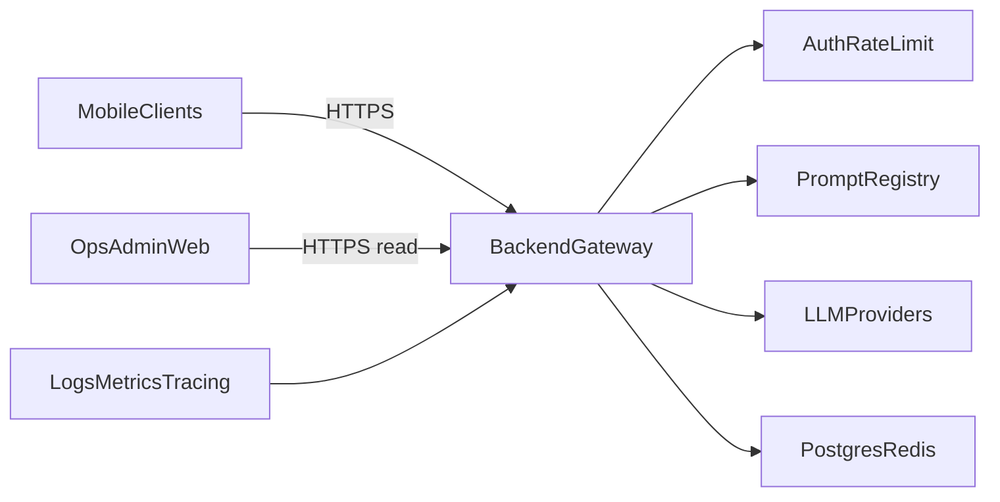

# System diagram

```mermaid
flowchart LR
mobileClient[MobileClients] -->|HTTPS| apiGateway[BackendGateway]
adminWeb[OpsAdminWeb] -->|HTTPS read| apiGateway
apiGateway --> authLayer[AuthRateLimit]
apiGateway --> promptLayer[PromptRegistry]
apiGateway --> llmProvider[LLMProviders]
apiGateway --> dataStore[PostgresRedis]
observability[LogsMetricsTracing] --> apiGateway
```
